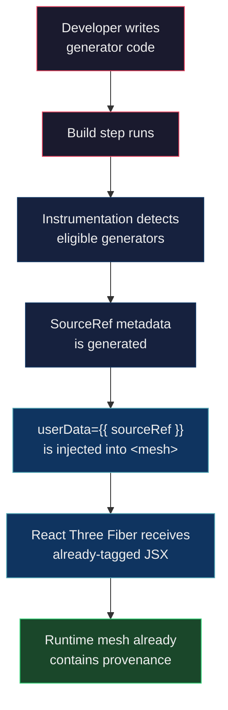
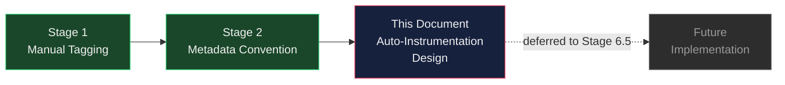

# Future Auto-Instrumentation Design

## Status

Design only.

Not implemented.

Implementation deferred until Stage 6.5.

---

## Purpose

The Stage 2 metadata convention requires every procedural generator to manually attach a `sourceRef` object to each `<mesh>` it produces:

```jsx
<mesh
  userData={{
    sourceRef: {
      file: 'TreeGenerator.jsx',
      function: 'createTree',
      line: 42,
      args: { x: 3, z: -1, seed: 7 },
    },
  }}
>
```

This manual tagging exists only for v0.1 validation. It is not intended to be the long-term developer workflow.

### Limitations of Manual Tagging

1. **Fragile under refactoring.** Line numbers are hardcoded. Renaming a function, moving it to another file, or inserting lines above it silently invalidates the `sourceRef` without any build-time or runtime error.

2. **Error-prone.** Developers must remember to add `sourceRef` to every mesh in every generator. Omitting it produces no warning — the mesh simply has no provenance, and the failure is silent.

3. **Tedious at scale.** A procedural world with hundreds of generator functions requires hundreds of manually maintained `sourceRef` blocks. The overhead grows linearly with the number of generators.

4. **Duplicated information.** The filename, function name, and line number already exist in the source code. Manual tagging duplicates this information, violating DRY and creating a maintenance burden.

5. **No enforcement.** There is no mechanism to verify that manual tags are correct or complete. A `sourceRef` pointing to the wrong file or function compiles and runs without error.

Automatic instrumentation eliminates all five limitations by deriving provenance from the source code itself.

---

## Scope

The future instrumentation is responsible for exactly two things:

1. **Automatically generating the existing `SourceRef` structure** — extracting `file`, `function`, `line`, and `args` from the source code at build time.

2. **Automatically attaching it using the Stage 2 metadata convention** — injecting `userData={{ sourceRef }}` as a declarative JSX prop on `<mesh>` elements.

### Explicit Boundaries

- It **must not** change the `SourceRef` contract. The runtime shape of `sourceRef` must remain identical to what manual tagging produces today.

- It **must not** invent a new metadata format. The output is the same `userData.sourceRef` object validated across all seven Stage 1–2 experiments.

- It **must not** add runtime dependencies. All instrumentation work is completed before the application runs.

---

## Desired Pipeline

The complete pipeline at a conceptual level:

```
Developer writes generator code
         │
         ▼
   Build step runs
         │
         ▼
Instrumentation detects eligible generators
         │
         ▼
  SourceRef metadata is generated
    (file, function, line, args)
         │
         ▼
userData={{ sourceRef }} is injected
  into <mesh> JSX elements
         │
         ▼
React Three Fiber receives already-tagged JSX
         │
         ▼
Runtime mesh already contains provenance
   (no reconstruction needed)
```



### Key Property

The application code itself never sees the instrumentation. From the perspective of React Three Fiber and the runtime, the JSX it receives is indistinguishable from manually-tagged JSX. The pipeline produces the same output as a developer who perfectly maintained every `sourceRef` by hand.

---

## Inputs

The instrumentation needs the following pieces of information to generate a complete `SourceRef`:

| Input | Source | Description |
|---|---|---|
| `file` | Filesystem / build context | The source file path of the generator function, relative to the project root. |
| `function` | Source code structure | The name of the generator function that produces the mesh. |
| `line` | Source code structure | The line number where the generator function is defined (or where the `<mesh>` element is returned). |
| `args` | Function parameters | The runtime arguments passed to the generator function at call time. These are the parameters that determine the specific mesh instance (e.g., `seed`, `x`, `z`). |

### Notes on Each Input

**`file`**: Available statically at build time. The build tool already knows which file it is processing.

**`function`**: Available statically at build time for named functions and named function expressions. Anonymous functions and arrow functions assigned to variables may require additional heuristics (see Open Questions).

**`line`**: Available statically at build time. The build tool's parser tracks source positions.

**`args`**: Partially dynamic. The parameter _names_ are available statically (from the function signature). The parameter _values_ are only known at runtime (when the generator is actually called). The instrumentation must capture argument values at call time and include them in the `sourceRef`. This is the only input that requires a runtime expression in the generated code.

---

## Outputs

The output of the instrumentation must exactly match the Stage 2 metadata convention.

The runtime shape of the injected metadata is:

```js
mesh.userData.sourceRef === {
  file:     String,    // relative source file path
  function: String,    // generator function name
  line:     Number,    // source line number
  args:     Object,    // runtime arguments at generation time
}
```

This is the same `SourceRef` structure defined in the Stage 2 metadata convention and validated across Experiments 1–7.

The instrumentation must not:

- Add additional fields to `sourceRef`.
- Wrap `sourceRef` in a container object.
- Change the location of `sourceRef` within `userData`.
- Use a different key name.

The attachment mechanism must remain:

```jsx
<mesh userData={{ sourceRef }}>
```

A declarative JSX prop. Never an imperative assignment after mount.

---

## Candidate Opt-In Strategies

The instrumentation must know which functions are eligible generators. Three approaches have been identified for how developers signal eligibility.

### 1. Directory / Config Inclusion

Generators are identified by their location in the project structure or by an entry in a configuration file.

Example: all files under `src/generators/` are treated as generator modules, or a config file lists specific files or glob patterns.

**Advantages**

- Zero changes to source code. Existing generator functions work without modification.
- Familiar pattern — many build tools use directory conventions (e.g., Next.js `pages/`, Remix `routes/`).
- Easy to apply to an entire category of files at once.

**Disadvantages**

- Coarse granularity. A file may contain both generator functions and helper functions — the instrumentation cannot distinguish them without additional signals.
- High false positive risk. Non-generator functions in an included directory would be incorrectly instrumented.
- Implicit contract. A new developer may not know that placing a file in a specific directory triggers instrumentation.
- Refactoring hazard. Moving a file out of the designated directory silently removes instrumentation.

---

### 2. Comment Annotation

Generators are marked with a special comment recognized by the instrumentation.

Example:

```jsx
// @provenance
function createTree(x, z, seed) { ... }
```

**Advantages**

- Explicit developer intent. The developer consciously opts in each function.
- Fine granularity. Individual functions within a file can be selectively instrumented.
- No runtime footprint. Comments are stripped during compilation.
- Familiar pattern — JSDoc, `@ts-ignore`, `@flow`, ESLint directives all use comment annotations.

**Disadvantages**

- Easy to forget. A missing annotation produces no error — the function simply has no provenance, and the failure is silent (same problem as manual tagging, but less severe).
- Not refactor-friendly in all editors. Some refactoring tools do not preserve or move associated comments.
- Not IDE-discoverable. Comments have no semantic meaning to the language server — no autocomplete, no type checking, no go-to-definition.

---

### 3. Wrapper API

Generators are wrapped in a function call that marks them as eligible.

Example:

```jsx
const createTree = provenance(function createTree(x, z, seed) { ... })
```

or

```jsx
const createTree = provenance((x, z, seed) => { ... })
```

**Advantages**

- Fully explicit. The instrumentation boundary is a first-class expression, not a comment.
- IDE-discoverable. `provenance` is a real identifier — it has a type signature, supports autocomplete, and can be navigated via go-to-definition.
- Refactor-friendly. Rename, extract, and inline refactorings preserve the wrapper because it is syntactically part of the expression.
- Enables type-level enforcement. TypeScript can enforce that `provenance()` receives a function with the correct signature.

**Disadvantages**

- Changes the developer's source code. The generator function must be wrapped, which is more invasive than a comment.
- Runtime import required (even if the wrapper is a no-op in production). The `provenance` function must exist as an importable identifier.
- Potential confusion about what the wrapper does at runtime vs. build time.
- Nesting wrappers (generator calling another generator) may create ambiguity about which function owns the provenance.

---

## Selection Criteria

The following criteria were established during Stage 2 for evaluating opt-in strategies. They are listed without ranking or scoring.

- **Low false positives.** The instrumentation should not attach provenance to functions that are not generators. Incorrectly instrumented functions would produce misleading `sourceRef` data.

- **Low false negatives.** The instrumentation should not miss functions that are generators. Uninstrumented generators would produce meshes without provenance — a silent failure.

- **Explicit developer intent.** The developer should consciously signal which functions are generators. Implicit detection based on heuristics (e.g., "returns JSX containing `<mesh>`") is brittle and opaque.

- **Minimal manual effort.** The opt-in mechanism should require as little per-function work as possible. The goal is to be significantly less effort than manual `sourceRef` tagging.

- **Refactor friendliness.** The opt-in signal should survive common refactoring operations: rename, move file, extract function, inline function, reorder parameters.

- **IDE discoverability.** The opt-in mechanism should be visible and navigable in standard IDE features: autocomplete, go-to-definition, find-all-references, type checking.

- **Zero runtime overhead after compilation.** The instrumentation should produce no additional runtime cost beyond the `sourceRef` object itself. No runtime library, no proxy objects, no event subscriptions, no global registries.

---

## Constraints

The future instrumentation **must**:

1. **Preserve the Stage 2 metadata convention.** The attachment mechanism remains `<mesh userData={{ sourceRef }}>` — a declarative JSX prop. The instrumentation may not introduce an alternative attachment mechanism.

2. **Produce identical runtime metadata to manual tagging.** Given the same generator function and the same arguments, the `sourceRef` produced by automatic instrumentation must be structurally identical to one written by hand. An automated test should be able to compare them with deep equality.

3. **Remain transparent to application code.** Components that consume meshes must not need to know whether provenance was attached manually or automatically. The instrumentation is invisible at the React component level.

4. **Not require runtime provenance reconstruction.** Provenance must be fully materialized at build time (for static information) and generation time (for runtime arguments). There must be no deferred computation, lazy evaluation, or runtime assembly of the `sourceRef` object.

---

## Open Questions

The following architectural questions are unresolved. They are listed here for future investigation. They are not answered in this document.

- **Opt-in mechanism selection.** Which of the three candidate strategies (directory/config, comment annotation, wrapper API) should be adopted? Are there hybrid approaches worth considering?

- **Multi-file generators.** How should instrumentation handle a generator function defined in one file that calls helper functions defined in other files? Which file and function name should appear in the `sourceRef`?

- **Nested generators.** If generator A calls generator B, and both produce meshes, should both be instrumented independently? How should the `sourceRef` reflect the call hierarchy?

- **Generated helper functions.** If a generator is created programmatically (e.g., via a factory function that returns generator functions), how does the instrumentation determine the correct `file`, `function`, and `line` values?

- **Anonymous functions.** Arrow functions and anonymous function expressions have no inherent name. Should the instrumentation infer a name from the variable assignment (e.g., `const createTree = (seed) => ...` → function name `createTree`)? What about functions passed directly as arguments?

- **Argument capture scope.** The `args` field must capture runtime argument values. For generators with many parameters, should all arguments be captured, or should there be a mechanism to select which arguments are relevant?

- **Conditional mesh creation.** If a generator conditionally returns a mesh (e.g., returns `null` in some cases), how does the instrumentation handle the `<mesh>` elements that may or may not be rendered?

- **Dynamic mesh counts.** A single generator call may produce a variable number of meshes (e.g., a forest generator that creates N trees). How should each mesh's `sourceRef` differentiate individual instances while still pointing to the same generator?

- **Source map interaction.** When the instrumentation modifies the source code, how does it ensure that source maps remain accurate for debugging purposes? (Note: source map implementation is explicitly a non-goal of this document, but the interaction must be considered.)

- **Performance budget.** What is the acceptable build-time cost of the instrumentation pass? Is there a threshold beyond which the instrumentation should be disabled or made incremental?

---

## Non-Goals

This document explicitly does **not** define:

- Babel implementation details
- AST traversal algorithms or visitor patterns
- Parser selection (Babel, SWC, OXC, or other)
- Source map generation or preservation
- Overlay UI design or implementation
- Inspector panel design or implementation
- MCP server integration or protocol
- Runtime engine architecture
- Code editing or modification features
- Write-back mechanisms (source code modification from the UI)

These topics belong to later stages and separate design documents.

---

## Relationship to Previous Stages



**Stage 1** proved that manual provenance tagging is technically viable. Across seven experiments — covering single meshes, generated collections, re-renders, mesh recreation, HMR, multi-part structures, and memoized generation — the `sourceRef` metadata survived every lifecycle scenario tested.

**Stage 2** standardized the metadata contract. The `SourceRef` structure (`file`, `function`, `line`, `args`) and the attachment convention (`<mesh userData={{ sourceRef }}>`) were locked and validated across all experiments. No experiment required deviation from the convention.

**This document** explains how the manual tagging validated in Stages 1–2 will eventually be automated. It defines the pipeline, inputs, outputs, constraints, and candidate strategies without committing to an implementation. The actual implementation is deferred to Stage 6.5.

---

## Exit Criteria

Stage 2 is complete when:

- [x] Metadata convention is locked
- [x] Metadata convention validated across all 7 experiments
- [x] Future instrumentation architecture documented (this document)
- [x] No implementation performed
